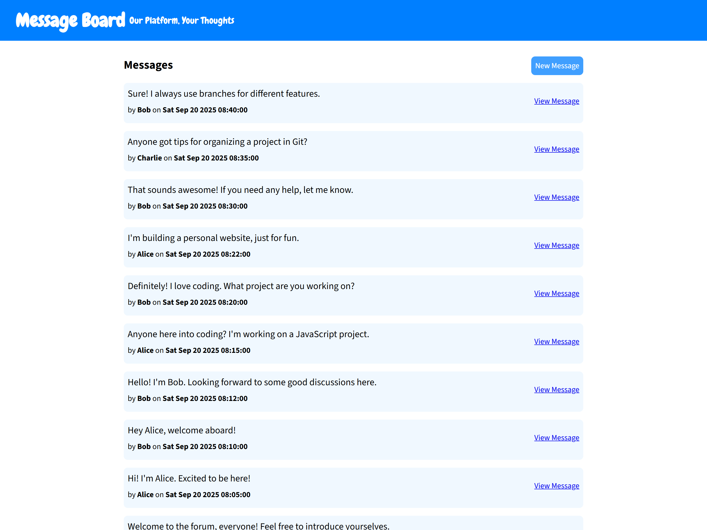

# Mini Message Board

This is a simple web application where users can leave messages on a virtual
board. Users can submit their name and message via a form, and the messages will
be displayed on the board in real-time. The app is built with Express for the
backend, EJS for rendering views, and a PostgreSQL database for storing the
messages.



## Built With

- Node.js and Express for server-side logic
- PostgreSQL for the database
- EJS templates for dynamic HTML rendering
- Deployed on Railway for easy access and hosting

## Live Demo

[Live version of the app on Railway](https://mini-message-board-production-d692.up.railway.app/)

## Installation

1. Clone the repository:

```bash
git clone https://github.com/ZohairGandhi/mini-message-board.git
cd mini-message-board
```

2. Install dependencies:

You need to have Node.js and NPM installed on your machine. Upon cloning the
repo, install the required dependencies.

```bash
npm install
```

3. Set up PostgreSQL:

- Ensure PostgreSQL is installed and running on your machine.
- Create a new database on PostgreSQL.

```
psql -U postgres
CREATE DATABASE message_board;
```

4. Set up environment variables:

Create a `.env` file in the root directory of the project with the following
variables.

```
PGHOST=your-database-host
PGUSER=your-database-user
PGDATABASE=message_board  # or whatever name you gave your database
PGPASSWORD=your-database-password
PGPORT=your-database-port
```

5. Run the database population script (optional):

- If you want to seed the database with some initial message data, you can run
  the script `db/populatedb.js`. This will create a `messages` table and insert
  a few rows of sample data.
  - If you do not wish to insert seed data, simply delete the `INSERT` statement
    in the script.

6. Run the app:

Start the server with the following command and access it at
`http://localhost:3000`

```bash
node app.js
```
